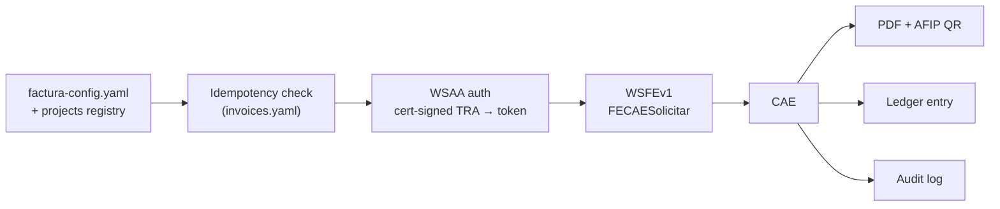

# arca-factura

**A small, auditable CLI that issues legally valid electronic invoices against Argentina's tax authority (AFIP/ARCA) web services.**

Built for monotributistas and freelancers who bill foreign clients in USD: it authenticates with your AFIP certificate (WSAA), requests a CAE through WSFEv1, and produces the final PDF with the official AFIP QR code — plus an idempotency ledger and an audit log so you can never invoice the same payment twice.

Supported comprobante types (all letter C / Monotributo):

| Code | Document |
| ---- | -------- |
| 11 | Factura C |
| 13 | Nota de Crédito C |
| 211 | Factura de Crédito Electrónica MiPyMEs (FCE) C |
| 213 | Nota de Crédito Electrónica MiPyMEs C |

*(Read this in Spanish: [README.es.md](README.es.md))*

> **Heritage note:** this tool grew out of an earlier Playwright experiment that scripted the AFIP web portal. That browser-automation code is **not part of this repository** — the `factura` package talks to the official SOAP web services directly, no browser involved.

## Why this exists

Issuing an electronic invoice programmatically in Argentina means dealing with WSAA (certificate-based SOAP authentication with signed CMS tickets) and WSFEv1 (a SOAP API with its own numbering, currency, and optional-field rules). The existing options each have a cost:

- **pyafipws** — powerful but heavy: a large codebase covering every AFIP web service, with legacy dependencies that are hard to audit for a tool that signs fiscal documents.
- **Hosted SDKs (e.g. Afip SDK)** — convenient, but your fiscal certificate and invoice data flow through a third party, usually for a fee.
- **The AFIP portal UI** — manual, slow, and error-prone for recurring monthly billing.

This tool takes a third path: **~2,000 lines of readable Python** you can audit in an afternoon, running entirely on your machine, with your certificate never leaving `~/.afip/`. It covers exactly one workflow — service invoices for a single emisor — and adds the governance layer that ad-hoc scripts lack.

## Key features

**Governance and reliability first:**

- **Idempotency ledger** (`invoices.yaml`) — every emitted invoice is recorded under a `{project}-{payment}` key. Re-running the same command prints the existing comprobante/CAE and exits cleanly. Nothing is ever invoiced twice by accident.
- **Append-only audit log** (`factura/audit.log`) — every emission leaves a timestamped line: `EMITIDA`/`NC_EMITIDA` with comprobante, CAE, amount, and environment; `DRY_RUN`/`DRY_RUN_NC` with tipo, amount, and PDF name. Idempotent re-runs ("YA EMITIDO") and AFIP-rejected attempts are not logged.
- **`--dry-run` mode** — renders the full PDF with a placeholder number, a red "BORRADOR (SIN CAE)" stamp and an "Este documento no tiene validez fiscal" notice, with **zero AFIP contact** and no ledger write. Review the document before anything becomes official.
- **Homologación support** (`--homo`) — run the complete WSAA + WSFE flow against AFIP's test environment before touching production.
- **Credit notes** (`--nc`) — emits a Nota de Crédito referencing the original invoice (`CbtesAsoc`), with its own idempotency key. Requires the original to exist in the ledger; refuses to emit a second NC for the same invoice.
- **Monotributo guardrail** — after each factura emission (live or dry-run; not on `--nc` runs or idempotent exits), the CLI sums the year's ARS-equivalent billing from the ledger and warns when you cross 80% of the **category H** cap (hardcoded — adjust `_print_annual_summary` if your category differs).

**Invoicing capabilities:**

- **USD invoicing with automatic exchange rate** — pre-flight estimate from the official BNA seller rate (dolarapi.com, bluelytics fallback); in live mode the authoritative rate comes from AFIP itself (`FEParamGetCotizacion`), per RG 4291/2018. Manual override available (`--cotizacion`).
- **FCE MiPyMEs** — sends the required Opcionales: CBU, alias, and transfer option for tipo 211, and the anulación flag on every `--nc` credit note (tipos 13 and 213 alike). Always emit credit notes via `--nc` — a direct `--tipo 213` emission would send the CBU/alias Opcionales instead of the anulación flag.
- **PDF output** — Jinja2 + WeasyPrint render an A4 invoice with the official AFIP QR code, saved with the AFIP-standard filename `{CUIT}_{tipo:03d}_{PV:05d}_{nro:08d}.pdf`.
- **Token caching** — the 12-hour WSAA ticket is cached in `~/.afip/token_cache.json`, so repeated runs skip authentication entirely.

## How it works



1. Load emisor config and look up the client/payment in an external projects registry (read-only).
2. Check the ledger — if this payment was already invoiced, print the existing CAE and stop.
3. Authenticate with WSAA: build a TRA ticket, sign it CMS/PKCS#7 with your certificate, exchange it for a token (cached ~12 h).
4. Ask WSFEv1 for the last authorized comprobante number, then call `FECAESolicitar` for the next one.
5. On approval, render the PDF with the CAE and QR, record the invoice in the ledger, and append to the audit log.

Details in [docs/ARCHITECTURE.md](docs/ARCHITECTURE.md).

## Install

Requires **Python 3.11+**.

```bash
git clone https://github.com/oxxo/arca-factura.git
cd arca-factura
pip install -e .
```

This installs the `factura` console script for invoicing runs. Note it is not fully equivalent to `python -m factura`: the `setup-cert` subcommand is only dispatched through `python -m factura`.

**Additional requirements:**

- **WeasyPrint native libraries** — WeasyPrint needs Pango/Cairo. On Windows install the GTK3 runtime; on Debian/Ubuntu `apt install libpango-1.0-0 libpangocairo-1.0-0`. See the [WeasyPrint installation docs](https://doc.courtbouillon.org/weasyprint/stable/first_steps.html). The CLI runs a fail-fast check before rendering.
- **openssl on PATH** — used once, by the certificate setup command.
- **An AFIP/ARCA certificate** bound to the `wsfe` (Facturación Electrónica) web service, and a punto de venta enabled for web-service invoicing. The built-in bootstrap walks you through it:

```bash
python -m factura setup-cert
```

This generates an RSA-2048 private key and CSR in `~/.afip/` and prints step-by-step instructions for the ARCA portal (create the certificate alias, paste the CSR, download the `.crt`, authorize the `wsfe` service). Run it again after installing the certificate to validate the key/cert pair and expiry.

## Usage

```bash
python -m factura <project> <payment#> [options]
```

`<project>` is matched against the registry by id prefix or name substring (case-insensitive); `<payment#>` is the payment number within that project.

```bash
# 1. Dry run — no AFIP contact, draft PDF stamped "BORRADOR (SIN CAE)"
python -m factura acme 1 --dry-run

# 2. Full flow against AFIP's homologación (test) environment
python -m factura acme 1 --homo

# 3. Live emission (environment comes from factura-config.yaml)
python -m factura acme 1

# 4. Re-running is safe — prints the existing CAE and exits
python -m factura acme 1
# *** YA EMITIDO *** Comprobante: 00000042 CAE: ...

# 5. Credit note for an already-emitted invoice (tipo 11→13, 211→213)
python -m factura acme 1 --nc
python -m factura acme 1 --nc --dry-run   # preview it first

# 6. Manual exchange rate (e.g. a MEP rate agreed with the client)
python -m factura acme 2 --cotizacion 1250.50

# 7. Fixed ARS amount — forces PES and skips all rate lookups
python -m factura acme 2 --monto 150000

# 8. Explicit service period and due date
python -m factura acme 3 --desde 20260101 --hasta 20260131 --vto 20260210
```

### Flags

| Flag | Effect |
| ---- | ------ |
| `--dry-run` | Draft PDF, no AFIP connection, no ledger write (audit-logged) |
| `--homo` | Force the homologación environment, overriding the config |
| `--tipo N` | Override comprobante type (default from the project's `billing.tipo_comprobante`) |
| `--desde` / `--hasta` | Service period, `YYYYMMDD` (default: today) |
| `--vto` | Payment due date, `YYYYMMDD` (default: today + 10 days) |
| `--concepto-override` | Replace the default description (`{payment description} - Pago n/total`) |
| `--monto` | Override amount in ARS; forces `MonId=PES`, cotización 1.0 |
| `--nc` | Emit a Nota de Crédito for an existing invoice |
| `--cotizacion` | Manual USD→ARS rate; skips both BNA estimate and AFIP lookup |

> **There is no `--prod` flag.** The live environment is whatever `ambiente:` says in `factura-config.yaml`. Keep it on `homologacion` until you have tested end to end — with `ambiente: produccion`, a bare `python -m factura acme 1` emits a real fiscal document.

## Configuration

Three files, three responsibilities. The two data files (`factura-config.yaml`, `invoices.yaml`) contain real fiscal data and are gitignored — start from the committed examples: [`factura-config.example.yaml`](factura-config.example.yaml), [`projects-registry.example.yaml`](projects-registry.example.yaml), [`invoices.example.yaml`](invoices.example.yaml).

### `factura-config.yaml` — who is invoicing

```yaml
emisor:
  nombre: "Perez Juan"
  cuit: "20123456789"
  condicion_iva: "Responsable Monotributo"
  domicilio: "Ciudad, Provincia"
  punto_venta: 1
  inicio_actividades: "01/01/2020"

certificado:
  key_path: "~/.afip/clave_privada.key"
  crt_path: "~/.afip/certificado.crt"

ambiente: "homologacion"   # "homologacion" | "produccion"

pago:                      # bank details printed on FCE invoices
  cbu: "0000000000000000000000"
  alias: "MI.ALIAS.CBU"
  condicion: "Transferencia Bancaria"

pdf:
  output_base: ""          # empty = <project path>/docs/facturas/

registry_path: "path/to/projects-registry.yaml"
```

### Projects registry — who gets invoiced

An external YAML file (consumed strictly read-only) holding client billing data and payment schedules:

```yaml
projects:
  - id: acme-001
    name: Acme Website
    path: "/projects/acme"          # PDFs land in <path>/docs/facturas/
    financials:
      currency: USD                  # USD payments trigger the exchange-rate flow
    billing:
      razon_social: "ACME S.A."
      cuit: "30123456789"
      condicion_iva: "IVA Responsable Inscripto"
      domicilio: "Av. Siempreviva 742, CABA"
      tipo_comprobante: 11           # 11 = Factura C, 211 = FCE MiPyMEs C
      referencia_comercial: ""       # e.g. client purchase-order number (FCE)
      opcion_transferencia: "SCA"    # FCE transfer option
      certificado_mipyme: false
    payments:
      - number: 1
        amount: 1000
        due: "2026-02-15"
        status: pending
        description: "Website design - phase 1"
      - number: 2
        amount: 1000
        due: "2026-03-15"
        status: pending
        description: "Website development - phase 2"
```

### `invoices.yaml` — what was invoiced (the ledger)

Written automatically after every successful live emission. Do not edit by hand.

```yaml
acme-1:
  comprobante: '00000001'
  tipo: 11
  cae: '00000000000000'
  cae_vto: '2026-02-25'
  monto: 1000
  moneda: DOL
  cotizacion: 1000.0
  concepto: 'Website design - phase 1 - Pago 1/2'
  filename: 20123456789_011_00001_00000001.pdf
  emitted: '2026-02-15'

acme-1-nc:        # credit notes get their own key
  comprobante: '00000002'
  tipo: 13
  # ...
```

## Project status

Working and in real production use by the author for recurring client invoicing (Factura C and FCE MiPyMEs, ARS and USD). That said:

- **Deliberately narrow scope**: single emisor, comprobante letter C only, `Concepto=2` (services), receivers identified by CUIT. Not a general-purpose AFIP library.
- **No automated test suite** — verification has been done against homologación and live production runs. Known limitations and hardening notes are documented in [docs/BEST-PRACTICES.md](docs/BEST-PRACTICES.md).
- **Maintenance policy: as-is.** This is published as working software, not a supported product. Issues and PRs are welcome but may go unanswered, and ARCA changes its web-service contract on its own schedule — pin what works for you, and fork freely.

## Disclaimer

This software is **not affiliated with, endorsed by, or supported by ARCA/AFIP**. It talks to their public web services (WSAA, WSFEv1) using your own certificate and credentials. Electronic invoices are legally binding fiscal documents: test in homologación first, verify every emitted comprobante, and use at your own risk. You remain solely responsible for your tax obligations.

## Documentation

- [docs/ARCHITECTURE.md](docs/ARCHITECTURE.md) — module-by-module design, data flow, AFIP protocol details
- [docs/BEST-PRACTICES.md](docs/BEST-PRACTICES.md) — operational guidance, known gaps, hardening checklist
- [README.es.md](README.es.md) — this document in Spanish

## License

[MIT](LICENSE)
