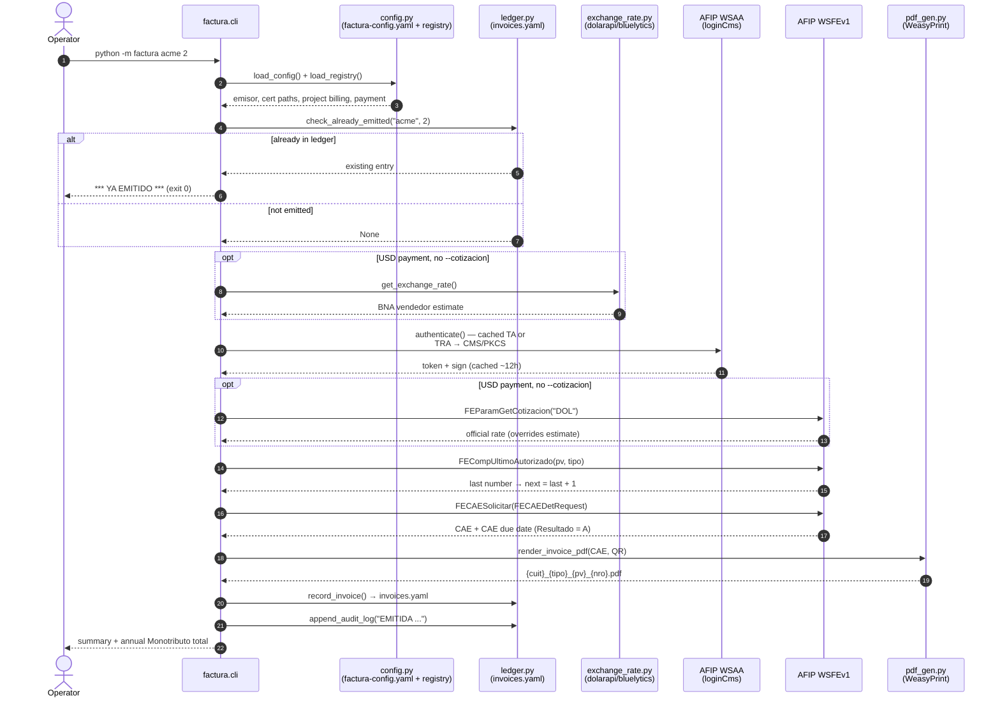

# Architecture

CLI tool for issuing Argentine electronic invoices (Factura C and FCE MiPyMEs C) against AFIP/ARCA web services, built for a Monotributo freelancer workflow. It authenticates via WSAA with an X.509 certificate, requests CAEs through WSFEv1 (SOAP), renders a PDF with the official AFIP QR code, and keeps a local idempotency ledger plus an append-only audit log.

The published repository contains a single component: **`factura/`**, the Python invoicing package. In the author's working tree the tool historically lived next to a legacy Playwright browser-automation experiment for the AFIP web portal; that code is fully decoupled and **not included in this repository** (its design is documented for the record in [section 8](#8-the-adjacent-playwright--docker-part)).

All examples in this document use placeholder data (`acme`, `globex`, CUIT `20-12345678-9`).

---

## 1. Module map (`factura/`)

| File | Responsibility |
| --- | --- |
| `__main__.py` | Entry point for `python -m factura`. Routes `argv[1] == "setup-cert"` to `setup_cert.main()` (stripping the subcommand from `argv`); everything else goes to `cli.main()`. |
| `cli.py` | Main orchestrator. Parses arguments, loads config and registry, runs the idempotency check, resolves currency/exchange rate and dates, then dispatches to one of three flows: `_run_dry_run()`, `_run_live()`, or `_run_nota_credito()`. Also prints the run summary and the annual Monotributo total (`_print_annual_summary()`, hardcoded category caps). |
| `config.py` | Config loader. Reads `factura-config.yaml` (emisor identity, certificate paths, `ambiente`, payment/CBU block, PDF output base, registry path) and the external `projects-registry.yaml` (client billing + payment schedule — consumed strictly **read-only**). Defines the dataclasses (`Emisor`, `Certificado`, `Pago`, `PdfConfig`, `AppConfig`, `Billing`, `Payment`, `ProjectData`) and the path constants `TOOL_ROOT`, `CONFIG_PATH`, `INVOICES_PATH`. `find_project()` matches a slug against project id prefix or name substring (case-insensitive), preferring candidates with a `billing` block and the shortest id; `find_payment()` looks up a payment by number. |
| `ledger.py` | Idempotency ledger (`invoices.yaml`) and audit log. `ledger_key()`, `check_already_emitted()`, `record_invoice()`, `get_annual_total()` (current-year ARS-equivalent sum, excluding credit notes), `append_audit_log()` (appends to `factura/audit.log`). |
| `afip_auth.py` | WSAA authentication client. Builds the TRA XML by hand, signs it as CMS/PKCS#7 with the `cryptography` library, calls the `loginCms` SOAP endpoint via `zeep`, and caches the resulting token/sign in `~/.afip/token_cache.json`. Also `validate_certificate()` (expiry check + key/cert pubkey match). |
| `afip_wsfe.py` | WSFEv1 SOAP client (`zeep`). Methods used by the CLI: `FECompUltimoAutorizado`, `FECAESolicitar`, `FEParamGetCotizacion`. `FECompConsultar` is implemented (`consultar_comprobante()`) but never called from the CLI. `_afip_session()` builds a `requests.Session` with a custom SSL context (`DEFAULT:@SECLEVEL=1`) to tolerate AFIP's weak DH keys; shared with the WSAA client. |
| `exchange_rate.py` | BNA official (vendedor) USD→ARS rate fetcher used as pre-authorization estimate: dolarapi.com first, bluelytics as fallback. RG 4291/2018 requires the BNA rate (not MEP/blue/CCL). |
| `pdf_gen.py` | PDF rendering: Jinja2 (`factura/templates/`) + WeasyPrint. Builds the official AFIP QR payload (base64 JSON → `https://www.afip.gob.ar/fe/qr/?p=...` → inline PNG), formats numbers in Argentine convention, builds the AFIP-standard filename `{cuit}_{tipo:03d}_{pv:05d}_{nro:08d}.pdf`, and provides a `check_weasyprint()` fail-fast probe. |
| `setup_cert.py` | `python -m factura setup-cert`: generates an RSA-2048 key + CSR in `~/.afip/` via `openssl`, prints step-by-step instructions for the ARCA portal (create certificate alias, paste CSR, download `.crt`, bind the `wsfe` service). Re-running with an existing key prompts `Overwrite? (y/N)`: answering N validates the already-installed certificate (if the `.crt` exists); answering y regenerates key+CSR, orphaning any installed certificate. |
| `spike_cms.py` | Standalone spike (not imported by anything) that proved CMS/PKCS#7 signing works with `cryptography` on Python 3.13 + Windows. Prototype for the code now in `afip_auth.py`. |
| `templates/factura_c.html` | Jinja2 A4 template for Factura C / Nota de Crédito / FCE MiPyMEs C: emisor/receptor blocks, service period, single-row detail table, USD block with exchange rate, conditional CBU/alias block for FCE, CAE + QR footer — or a red "BORRADOR (SIN CAE)" banner when there is no CAE (dry-run). |

Runtime state outside the repo: `~/.afip/` holds the private key, certificate, and WSAA token cache. The ledger (`invoices.yaml`) lives at the tool root; the audit log at `factura/audit.log` (gitignored).

---

## 2. End-to-end flow of an emission

Invocation: `python -m factura <project> <payment#> [flags]` (or the `factura` console script defined in `pyproject.toml`).

1. **Config load** — `load_config()` reads `factura-config.yaml`: emisor (name, CUIT, punto de venta), certificate paths, `ambiente`, CBU/alias, PDF output base, registry path.
2. **Registry lookup** — `load_registry()` reads the external `projects-registry.yaml` (read-only). `find_project(slug)` matches by id prefix or name substring; `find_payment(n)` selects the payment. Client name, CUIT, comprobante type, and amount all come from the registry.
3. **Idempotency check** — `check_already_emitted(slug, n)` against `invoices.yaml`. If the key exists, the CLI prints `*** YA EMITIDO ***` with comprobante/CAE/date/filename and exits 0. (With `--nc` the check is inverted — see [section 6](#6-credit-note-nc-flow).)
4. **Comprobante type** — `--tipo` override, else `billing.tipo_comprobante` from the registry (default 11 = Factura C; 211 = FCE MiPyMEs C).
5. **Currency & exchange rate** — `--monto` forces ARS (`MonId=PES`, cotización 1.0). USD payments use `--cotizacion` if given, otherwise the BNA estimate from `exchange_rate.get_exchange_rate()` (see [section 7](#7-exchange-rate-resolution)).
6. **Dates** — service period `--desde`/`--hasta` default to today (`YYYYMMDD`); payment due `--vto` defaults to today + 10 days.
7. **Concepto** — `--concepto-override`, else `"{payment.description or project.name} - Pago {n}/{total}"`.
8. **Environment** — `homologacion` if `--homo`, else `ambiente` from config. Output directory = `pdf.output_base` or `{project.path}/docs/facturas`.

Then the live flow (`_run_live()`):

1. **WSAA authentication** (`afip_auth.authenticate()`):
   - Return the cached token if `~/.afip/token_cache.json` has an entry for `wsfe_{ambiente}` that is still valid (expiry minus a 5-minute safety margin).
   - Otherwise: validate the certificate (exists, not expired, private key matches cert pubkey) → build a TRA (`loginTicketRequest` XML, 12-hour validity, Argentina UTC-3 timestamps) → sign it CMS/PKCS#7 (SHA256, DER, `Binary` option) → call `loginCms` on the WSAA SOAP endpoint via `zeep` → parse `token`/`sign`/`expirationTime` from the response → cache it.
   - The resulting token+sign pair (the "TA") authenticates every subsequent WSFE call.
2. **WSFE client** — `WSFEClient(token, sign, cuit, ambiente)` over the SECLEVEL=1 SSL session. Every call carries `{Token, Sign, Cuit}`.
3. **Official rate** — for USD without `--cotizacion`: `FEParamGetCotizacion("DOL")` overrides the BNA estimate (falls back to the estimate with a warning if the call fails).
4. **Numbering** — `FECompUltimoAutorizado(pv, tipo)` → next number = last + 1 (never stored locally).
5. **FCE opcionales** — for tipos 211/213 the request adds `Opcionales`: Id 2101 (CBU), 2102 (alias), 27 (opción de transferencia, default `SCA`).
6. **CAE request** — `FECAESolicitar` with one `FECAEDetRequest`: `Concepto=2` (Servicios), `DocTipo=80` (CUIT), `ImpTotal=ImpNeto` (USD amount if `MonId=DOL`, else ARS), `ImpIVA=0`, service dates, `FchVtoPago` (omitted for NC tipos 13/213). If `Resultado != "A"` the CLI exits printing AFIP's `Observaciones` codes.
7. **PDF render** — `check_weasyprint()` probe, then `render_invoice_pdf()` with the CAE and the AFIP QR → `{output_dir}/{cuit}_{tipo:03d}_{pv:05d}_{nro:08d}.pdf`.
8. **Ledger write** — `record_invoice()` adds the entry to `invoices.yaml`.
9. **Audit append** — `append_audit_log("EMITIDA ...")`.
10. **Summary** — console summary + annual total vs. the Monotributo category cap (warning above 80%).



---

## 3. The idempotency ledger

`invoices.yaml` (tool root) is a flat YAML map keyed by:

```text
{project_slug}-{payment_number}        # invoice
{project_slug}-{payment_number}-nc     # credit note for that invoice
```

Example (placeholder data):

```yaml
acme-2:
  comprobante: '00000042'
  tipo: 11
  cae: '00000000000000'
  cae_vto: '2026-01-25'
  monto: 1000.0
  moneda: DOL
  cotizacion: 1000.0
  concepto: Acme website - Pago 2/4
  filename: 20123456789_011_00001_00000042.pdf
  emitted: '2026-01-15'
```

Semantics:

- Re-running an already-emitted invoice is **safe**: the CLI prints the existing comprobante/CAE and exits 0 without contacting AFIP.
- The ledger is written **only** on successful live emission (`record_invoice()` after the CAE and PDF exist). Dry-runs never touch it.
- `save_ledger()` rewrites the whole file (`yaml.dump`, insertion order preserved).
- `get_annual_total()` sums the current year's ARS-equivalent amounts (USD entries: `monto * cotizacion`), skipping keys containing `-nc` and tipos 13/213 — this feeds the Monotributo cap warning.

Why YAML and local-first: the tool issues a handful of invoices per month for one emitter. A human-readable, diffable, hand-editable file beats a database at this scale — the operator can inspect it, annotate it, and back it up trivially. AFIP itself remains the authoritative record (comprobante numbers are always derived live from `FECompUltimoAutorizado`, never from the ledger); the ledger's only job is preventing accidental double emission and tracking the annual total.

---

## 4. Audit log

`ledger.append_audit_log()` appends one line per run to `factura/audit.log` (gitignored, lives next to the code):

```text
{YYYY-MM-DDTHH:MM:SS} {EVENT} {slug} pago={n} key=value ...
```

Four event types: `DRY_RUN`, `DRY_RUN_NC`, `EMITIDA`, `NC_EMITIDA`. Sanitized examples:

```text
2026-01-15T10:23:45 DRY_RUN acme pago=2 tipo=11 monto=1000 USD pdf=20123456789_011_00001_XXXXXXXX.pdf
2026-01-15T10:31:02 EMITIDA acme pago=2 cbte=00000042 cae=00000000000000 tipo=11 monto=1000 USD ambiente=produccion pdf=20123456789_011_00001_00000042.pdf
2026-02-01T09:10:11 NC_EMITIDA acme pago=2 cbte=00000007 cae=00000000000000 nc_tipo=13 monto=1000 USD ambiente=produccion pdf=20123456789_013_00001_00000007.pdf
```

Every **completed** flow leaves a trace — including dry-runs, which never reach the ledger; only live emissions write both. But `append_audit_log()` is called only at the end of `_run_dry_run`, `_run_live`, and the two `_run_nota_credito` branches — runs that exit early leave **no** audit entry: idempotency hits (`*** YA EMITIDO ***` / `*** NC YA EMITIDA ***`, exit 0), config/registry/payment lookup errors, WSAA failures, and AFIP rejections (`sys.exit` in `afip_wsfe`).

---

## 5. Environments

| Mode | How | AFIP contact | Comprobante number | PDF | Ledger | Audit |
| --- | --- | --- | --- | --- | --- | --- |
| **Dry-run** | `--dry-run` | None at all | Placeholder `XXXXXXXX` | Rendered with red "BORRADOR (SIN CAE) — sin validez fiscal" banner, no QR | Not written | `DRY_RUN` |
| **Homologación** | `--homo` | Full WSAA + WSFE against the `homo` endpoints | Real (test environment) | Full, with CAE + QR | Written | `EMITIDA ambiente=homologacion` |
| **Producción** | Default (from `ambiente` in `factura-config.yaml`) | Full WSAA + WSFE against production endpoints | Real fiscal document | Full, with CAE + QR | Written | `EMITIDA ambiente=produccion` |

Note the asymmetry: there is **no `--prod` flag**. With `ambiente: produccion` in the config, a bare `python -m factura acme 2` emits a real fiscal document — `--dry-run` and `--homo` are the opt-in safety valves. The WSAA token cache is keyed per environment (`wsfe_homologacion` / `wsfe_produccion`), so switching environments never reuses the wrong token.

---

## 6. Credit note (NC) flow

`--nc` emits a Nota de Crédito against an already-emitted invoice:

1. **Inverted idempotency**: the original ledger entry `{slug}-{n}` **must** exist (error otherwise), and `{slug}-{n}-nc` must **not** (prints `*** NC YA EMITIDA ***` and exits 0 if it does).
2. **Type mapping**: `_nc_tipo()` maps `11 → 13` and `211 → 213`; any other original type aborts ("No NC type mapping").
3. **Reference to the original** via `CbtesAsoc` in the `FECAESolicitar` request:

   ```python
   {"Tipo": original_tipo, "PtoVta": punto_venta, "Nro": original_nro,
    "Cuit": emisor_cuit, "CbteFch": original.get("emitted", today_fmt).replace("-", "")}
   ```

   i.e. the original type, point of sale, number, the **emitter's** CUIT, and the original emission date taken from the ledger's `emitted` field (ISO date with dashes stripped) — silently falling back to **today's date** if the ledger entry lacks `emitted`, which compounds the association-date caveat in [section 9](#9-known-limitations--non-goals).
4. **Opcionales differ from the invoice**: the NC never includes the CBU (2101), alias (2102), or transferencia (27) fields — instead the code sets `opcionales = [{"Id": 22, "Valor": "S"}]` (Anulación) **unconditionally for every live NC**, not just FCE: a plain Nota de Crédito C (tipo 13) also sends it, since the Id 22 opcional is not gated on tipo 213 (latent quirk). Additionally, `afip_wsfe` omits `FchVtoPago` for tipos 13/213.
5. **Numbering** is independent: `FECompUltimoAutorizado` is queried for the NC type.
6. The concepto is prefixed with `"NC: "`, the entry is recorded under the `-nc` ledger key, and the audit event is `NC_EMITIDA`.
7. `--nc --dry-run` works: it renders the draft NC PDF and logs `DRY_RUN_NC` without contacting AFIP or writing the ledger.

Credit notes are excluded from the annual Monotributo total (both by the `-nc` key filter and by tipo 13/213).

---

## 7. Exchange rate resolution

Applies to USD payments only (`--monto` forces `MonId=PES` with cotización 1.0 and skips everything below). Per RG 4291/2018, the applicable rate is the **BNA vendedor** (official), not MEP/blue/CCL.

Resolution order:

1. **`--cotizacion RATE`** — manual override (e.g. a MEP rate agreed with the client). Skips both the web lookup and the AFIP call.
2. **Pre-authorization estimate** (`exchange_rate.get_exchange_rate()`), fetched before any AFIP contact:
   - `GET https://dolarapi.com/v1/dolares/oficial` → `venta` field (10 s timeout);
   - on failure, fallback to `GET https://api.bluelytics.com.ar/v2/latest` → `oficial.value_sell`;
   - if both fail, the CLI prompts interactively for a manual rate (`input()`).
3. **Live mode only**: after WSAA/WSFE setup, `FEParamGetCotizacion("DOL")` returns the official AFIP/BNA rate, which **overrides** the step-2 estimate. If that call fails, the CLI keeps the estimate and prints a warning.

In dry-run mode only steps 1–2 apply (there is no AFIP connection). The invoice is sent with `MonId=DOL`, `ImpTotal` in USD, and `MonCotiz` = the resolved rate; the PDF shows both the USD amount and the ARS equivalent.

---

## 8. The adjacent Playwright / Docker part

*(Historical note — these files are **not included in this repository**; they remain in the author's local tree.)*

`src/afip-login.ts` is a standalone exploratory script that automates a browser login to the AFIP **web portal** (`auth.afip.gob.ar/contribuyente_/login.xhtml`) with Playwright. It is **not part of the invoicing pipeline**: no imports, no shared files or state, different language and runtime. The Python package replaced it by talking to the WSAA/WSFE web services directly with certificate-based auth; the script remains as a legacy diagnostic for manual portal access.

What it does: reads `AFIP_CUIT` / `AFIP_PASS` from environment variables (exits if missing), launches headed Chromium, fills the CUIT (`input[name="F1:username"]`) and password fields, clicks through, saves full-page screenshots of each step to `/app/screenshots`, heuristically declares success if the URL contains `contribuyente` or `portal`, then keeps the browser open for 5 minutes for viewing over VNC.

The Docker setup exists **only** for this script — the Python package runs on the host, uncontainerized. The image (`mcr.microsoft.com/playwright:v1.45.1-jammy`) adds Xvfb, x11vnc, and noVNC; `entrypoint.sh` starts a virtual display and a noVNC bridge on port 6090 (`http://localhost:6090/vnc.html`), then idles — the script is run manually via `docker exec ... npx tsx src/afip-login.ts`. `docker-compose.yml` live-mounts `./src` and `./screenshots`. The hardcoded `/app/screenshots` path means the script only runs sensibly inside the container.

---

## 9. Known limitations / non-goals

- **No tests.** No test files, no CI. `spike_cms.py` is a run-once prototype, not a test suite.
- **CAE-consumed-but-unrecorded window.** In the live flow, the WeasyPrint probe, PDF render, and ledger write all happen **after** `FECAESolicitar` succeeds. If any of them fails, the CAE exists at AFIP but the ledger has no entry — a retry would emit a second comprobante. `consultar_comprobante()` (`FECompConsultar`) exists exactly for this recovery but is never wired into the CLI.
- **No production confirmation gate.** Production is the implicit default when the config says so; only `--homo` and `--dry-run` are opt-in.
- **Hardcoded Monotributo caps** in `cli.py` (`MONO_CAPS`, "2025/2026 approximate"); only category H is checked, and the values will silently go stale.
- **Ledger fragility.** `invoices.yaml` is rewritten whole on every save with no locking or backup; concurrent runs or a crash mid-write could lose it. Hand-edits are tolerated by YAML but not understood by the code.
- **Ledger inconsistencies.** NC entries store `cae_vto` in `DD/MM/YYYY` display format while invoices store ISO `YYYY-MM-DD`; NC `monto` is the payment amount in its original currency, while a live invoice stores the computed `imp_total`. `get_annual_total()`'s year filter assumes ISO `emitted` dates.
- **NC association date** (`CbtesAsoc.CbteFch`) comes from the ledger's `emitted` field, which is the local run date — if it ever diverged from the `CbteFch` actually sent to AFIP, the association could be rejected.
- **Interactive fallbacks** (`input()` for a failed rate lookup, the setup-cert overwrite prompt) break non-interactive/scripted use.
- **`sys.exit()`-based error handling throughout** — no exceptions, retries, or queueing; a transient AFIP error mid-flow just aborts.
- **WSAA token cached as plaintext JSON** in `~/.afip/token_cache.json` (bearer-equivalent for up to 12 h). Kept outside the repo, but not encrypted.
- **Silent QR omission**: if the `qrcode` package is missing, `generate_qr_data()` returns an empty string and the PDF is produced without its QR, with no warning.
- **`--tipo` help text is misleading**: it says `011|211`, but `type=int` means `011` parses as `11`. Only tipos with an NC mapping (11, 211) support `--nc`.
- **Dry-run filename** is built via a string replace (`_00000000.pdf` → `_XXXXXXXX.pdf`) rather than a proper placeholder parameter.
- **Playwright/Docker side is vestigial** (and excluded from this repository): plaintext portal credentials via env vars, fixed sleeps and brittle selectors, x11vnc without a password, a mapped port 3001 that nothing listens on, and no npm scripts.
- **Non-goals**: multi-emitter support, IVA-registered comprobante types (A/B), products (Concepto 1), batch emission (`CantReg` is always 1), and any write access to the external project registry (explicitly read-only).
